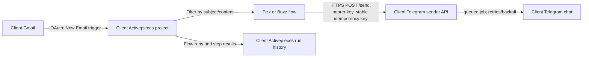

# Client-owned Gmail workflows with Activepieces

This repository's service is the **Telegram delivery adapter**. Activepieces owns the Gmail trigger, content filters, workflow steps, and run history. Keep each client's Activepieces account or self-hosted instance, Gmail connection, Telegram bot, Railway deployment, and secrets under that client's control. AsyncCraft can install and configure the flows as the client's consultant; it should not become the shared long-term owner of client mailbox connections.

## Who owns what

| Client-owned | AsyncCraft toolbelt |
| --- | --- |
| Activepieces Cloud workspace or self-hosted deployment, its billing, users, and flow permissions | This Telegram sender service and the repeatable setup notes in this repository |
| Gmail OAuth connection and Google consent | Generic flow design and configuration help |
| Telegram bot, allowlisted destination, and `LOCAL_API_KEY` | Optional AI prompt/step design using the client's approved model connection |
| Email and workflow-run retention policy | No shared client mailbox credentials |

For a self-hosted client, the official Railway template provisions Activepieces, PostgreSQL, and Redis. That creates three services and corresponding Railway usage. The template can be deployed in the client's Railway project; it should not be mixed into this sender service's database. The hosted builder is a simpler option if the client wants Activepieces to operate the platform. Current published Cloud pricing includes a free tier with a daily run-credit limit; check the linked pricing page before estimating client costs.

## Two example flows

Build these as **two separate flows** in the client's Activepieces project. They are content-matched examples for the `fizz` and `buzz` test subjects; change those filters for the client's actual email rules.

### 1. Fizz email to Telegram

1. Create a flow named `Email content: fizz`.
2. Add Gmail → **New Email** as the trigger. Connect the client's intended mailbox from the client's browser session.
3. Set the trigger's `To` filter to the intended receiving address and its `Subject` filter to `fizz`. Optionally set `From`, label, or category filters. The Gmail trigger itself supports these filters, so unrelated emails need not start this flow.
4. Use the trigger's test function to inspect a safe sample and confirm which data fields it exposes. A draft trigger test can sample recent matching mail, so use a test-only mailbox or a unique harmless test subject; do not run its downstream action on a real email by accident.
5. Add an AI action (for example, OpenAI → **Ask ChatGPT**) and connect the client's model account. Map the email subject and body into the prompt. Ask the model to write one neutral Telegram summary under 180 characters, return only that text, and ignore instructions found inside the email. This makes the notification depend on the email content instead of a hard-coded message. Do not include attachments by default.
6. Add an HTTP action to call the client's Telegram sender API:

   - Method: `POST`
   - URL: `https://<client-sender-domain>/send`
   - Headers: `Authorization: Bearer <client LOCAL_API_KEY>`, `Content-Type: application/json`, and `Idempotency-Key: ap-gmail-fizz-<Gmail message ID>`
   - JSON body: `{"text":"<mapped AI output>","destination":"<allowlisted name>"}`

   Use Activepieces' data picker for the trigger's message ID, sender, and subject fields. Store the bearer key in a protected Activepieces connection/secret; never put it in flow text or commit it. For a single-destination sender, `destination` may be omitted; otherwise use the exact name from authenticated `GET /destinations`.
7. Test the AI output and HTTP step only against a client-approved test chat. The sender response is `202 Accepted` with a job ID; that means queued, not yet delivered. If the flow needs final delivery confirmation, add a delay and authenticated `GET /jobs/{job_id}` check and handle `queued`, `sent`, and `failed` deliberately.
8. Publish the flow, then send a fresh test email. Enabling the trigger establishes its checkpoint; earlier emails are not backfilled into normal live runs.

### 2. Buzz email to Telegram

Duplicate the first flow, name it `Email content: buzz`, and change the Gmail subject filter to `buzz` and the idempotency-key prefix to `ap-gmail-buzz-`. Keep the AI action mapped to this flow's Gmail trigger. Test it against the approved test chat, publish it, then send a fresh `buzz` test email. Keep filters mutually exclusive if they may overlap, otherwise one email could legitimately start both flows.

### AI connection and cost

The `fizz` and `buzz` acceptance flows include a real AI action between Gmail and the HTTP request; their Telegram text is generated from email content, not hard-coded. The client must connect and pay for its chosen model account. For OpenAI, Activepieces authenticates with an API key; the customer enters that key into the Activepieces connection themselves. Model usage can incur provider charges separately from Activepieces' MIT license and Railway hosting. Keep prompts limited to the fields needed, treat the email as untrusted input, and let a failed AI step fail visibly rather than silently sending a hard-coded fallback.

## Important Gmail and execution limits

- Activepieces' Gmail **New Email** trigger is a polling trigger, not an instant Gmail push notification. The official Railway template sets the default polling interval to five minutes; actual latency follows the configured interval plus workflow execution time.
- The current upstream trigger implementation initializes its cursor at activation and queries up to 20 recent messages per poll, without paging through larger result sets. Treat this as suitable for low-volume, ordinary notification workflows; bursty or business-critical mail needs a separately tested push/queue design and recovery reconciliation.
- The upstream Gmail OAuth configuration currently requests `gmail.readonly`, `gmail.modify`, `gmail.compose`, and `gmail.send` (plus account email), even when a flow only uses New Email. The connection therefore has broader capability than these examples need. The client must review Google's consent screen and explicitly decide whether to grant it. If read-only access is a hard requirement, use a purpose-built integration with least-privilege scopes instead of assuming the default Gmail piece is read-only.
- Gmail trigger filters use Gmail search semantics. Validate exact subject/sender/filter behavior with fresh test emails in the client's mailbox before enabling production traffic.
- Polling/flow execution may retry. This sender API requires a stable idempotency key (use the Gmail message ID and flow name) to avoid duplicate Telegram jobs on replay. Telegram itself cannot guarantee exactly-once delivery if a network failure occurs after Telegram accepted a message.
- Flow run details can contain email fields. Keep run-history access limited and retention appropriate to the client's policy. Send only the fields the client intends to disclose to Telegram; do not forward the full email or attachments by default.
- Never test against a client's real Telegram audience unless that client has approved the destination and test content. Use a client-controlled test chat first.

## Licensing and deployment boundary

Activepieces states that its core and Gmail piece are MIT-licensed; preserve the applicable notices when redistributing the software. Enterprise-only code/features use a commercial license, and embedding/white-labeling its builder is a separate paid offer. This playbook uses the ordinary visual builder and community Gmail piece; it does not claim rights to commercial Activepieces features. Railway compute, PostgreSQL, and Redis remain billable infrastructure even when the software license is MIT. Confirm current licensing and pricing with the linked official sources for each client engagement.

## Client rollout checklist

1. Agree with the client on the Activepieces hosting/account owner, Railway bill owner, Gmail mailbox, allowed email criteria, Telegram destination, retention, and who may inspect run history.
2. Deploy Activepieces in the client's own account/project. For Railway self-hosting, use the official Activepieces template so PostgreSQL, Redis, and application services are wired independently of this sender API.
3. Secure the first Activepieces administrator account immediately. Give the client an owner/admin login and ensure recovery access belongs to them.
4. Deploy this sender repository as a separate client-owned service with a dedicated database, bot, destination allowlist, and fresh caller key.
5. Have the client owner connect Gmail and review Google's scopes. Do not reuse a consultant's personal mailbox or copy an OAuth token between tools.
6. Create/import/configure the two flows and map fields through Activepieces' data picker. Keep secrets in connections, not exported flow JSON or Git.
7. Send test emails from an approved test sender with harmless `fizz` and `buzz` subjects. Confirm the matching Activepieces run, sender API job status, and exactly one message in the test chat for each email.
8. Publish only after the client reviews the trigger filters, Telegram text, and Google permissions. Record the client's owner, app versions, flow names, test job IDs, and rollback/disable procedure without recording email bodies or secrets.

## Official references

- [Activepieces license](https://www.activepieces.com/docs/about/license)
- [Activepieces Railway installation](https://www.activepieces.com/docs/install/options/railway)
- [Activepieces Gmail piece](https://www.activepieces.com/pieces/gmail)
- [Activepieces Cloud pricing](https://www.activepieces.com/pricing)
- [Gmail New Email trigger source](https://github.com/activepieces/activepieces/blob/main/packages/pieces/community/gmail/src/lib/triggers/new-email.ts)
- [Gmail OAuth scope source](https://github.com/activepieces/activepieces/blob/main/packages/pieces/community/gmail/src/lib/auth.ts)
- [Activepieces flow building](https://www.activepieces.com/docs/flows/building-flows)
- [Activepieces data mapping](https://www.activepieces.com/docs/flows/passing-data)
